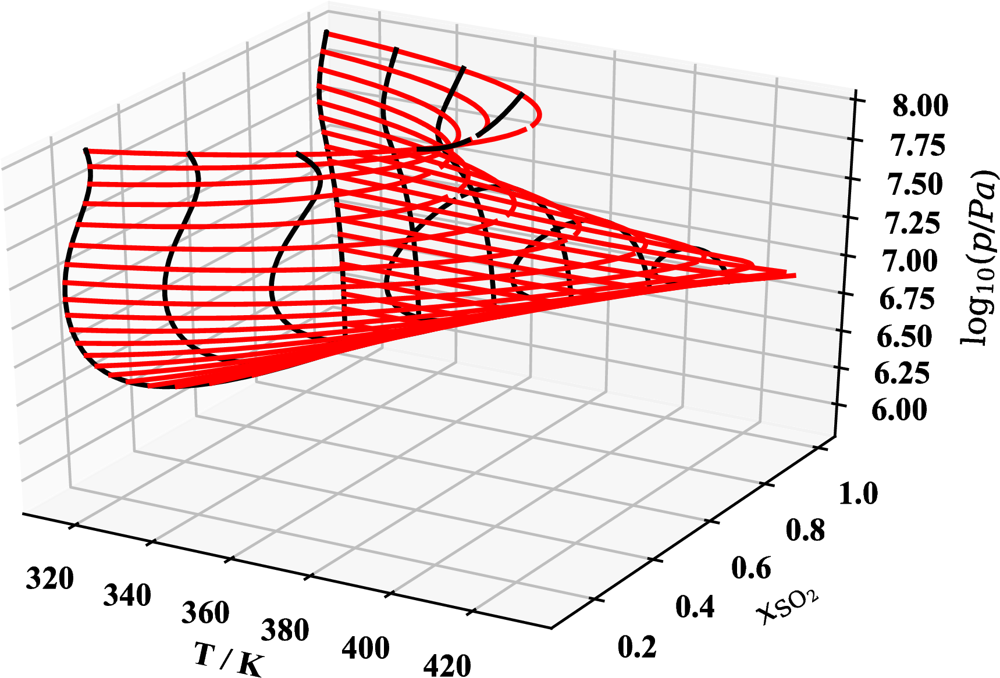

# Isochoric isoline tracing code

 

## Credits

All code written by Ian Bell, leveraging a number of open-source packages:

* pybind11
* Eigen
* cmake
* CoolProp

The tracing library was originally written with [CoolProp](https://www.coolprop.org) as the computational backend, and has since been extended to enable the use of NIST REFPROP as well.

Questions should be directed to ian.bell@nist.gov

## Citation

If you use this library in any capacity in scholarly work, please cite the following paper:

```
@Article{Bell-AICHEJ-2018,
  author    = {Ian H. Bell and Ulrich K. Deiters},
  title     = {{On the construction of binary mixture p-x and T-x diagrams from isochoric thermodynamics}},
  journal   = {AIChE J.},
  year      = {2018},
  volume    = {64},
  pages     = {2745--2757},
  doi       = {10.1002/aic.16074},
  publisher = {Wiley-Blackwell},
}
```

## Common pre-requisites

* C+11 Compiler 
    * Windows: MSVC 2015+; the (free) express version works great
    * OSX/linux: the standard C++11 compilers are fine: clang, g++
* cmake
* python (your best bet is a full anaconda installation which includes everything needed to run the plots)

## Python Module

In the root directory, do:
```
python setup.py install
```
then to run the examples, do
```
python run_iso.py
```

If you have the anaconda installation, it should "just work"

## Standalone C++ example

In the root directory, do

```
mkdir build
cd build
cmake .. -DISOCHORIC_ALL=ON -G GENERATOR -DCMAKE_BUILD_TYPE=Release
cmake --build . --config Release
Release/psi_tests  (or ./psi_tests on linux/OSX)
```
where GENERATOR is your desired generator, it could be something like ''Visual Studio 14 2915 Win64" for a 64-bit build for Microsoft Visual Studio 2015.  See the cmake documentation for more information on generators